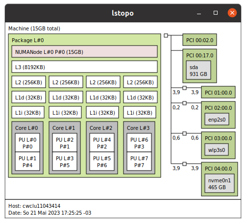
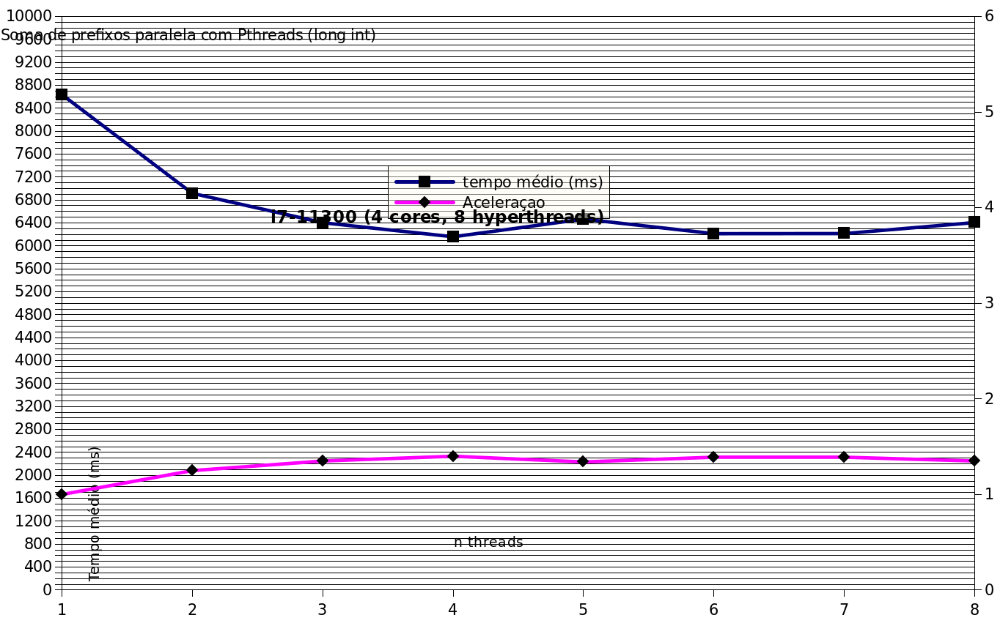
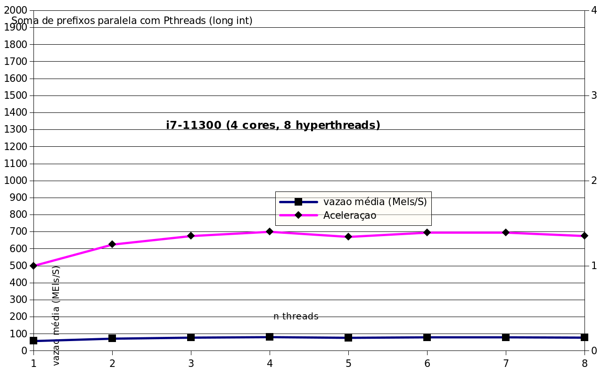

> CI1316 1º semestre 2023
> Lucas Müller
> GRR20197160

# Trabalho 1

## Introdução

Neste trabalho, propomos a implementação do algoritmo "Soma de Prefixos" em C++, utilizando a biblioteca Pthreads para obter paralelismo. O objetivo principal é desenvolver uma implementação paralela mais eficiente desse algoritmo e fornecer evidências empíricas que sustentem essa afirmação.

## Implementação

A implementação do algoritmo "Soma de Prefixos" consiste em duas funções principais: `threadPrefixSum` e `ParallelPrefixSumPth`.

A função `threadPrefixSum` é a função executada por cada thread. Ela recebe um argumento `arg` que contém informações sobre o bloco de elementos a ser processado por essa thread. A função realiza a soma parcial dos elementos do bloco atribuído à thread e armazena o resultado na matriz `partialSum`, correspondente à soma parcial de cada thread. Em seguida, é aguardada a sincronização de todas as threads utilizando a barreira `pthread_barrier_wait` para garantir que todas as somas parciais estejam disponíveis.

Após a sincronização, a função calcula o prefixo da soma acumulada para cada thread. A partir do `prefixSum` da thread anterior, a função itera a partir do índice da thread atual até a primeira thread, somando os valores correspondentes das somas parciais. Em seguida, é realizada a atualização dos elementos de saída `OutputVector` com os valores corretos da soma acumulada do prefixo.

Já a função `ParallelPrefixSumPth` é a função principal responsável por criar e gerenciar o pool de threads. Ela divide o número total de elementos `nTotalElmts` igualmente entre as threads, atribuindo a cada uma um bloco de elementos a ser processado. Além disso, ela cria uma barreira de sincronização `pthread_barrier_t` para garantir que todas as threads tenham concluído a soma parcial antes de prosseguir para o cálculo do prefixo.

A função itera sobre o número de threads desejadas, criando cada thread com a função `pthread_create` e passando o respectivo argumento `args`. Após a criação de todas as threads, a função aguarda a finalização de cada uma delas utilizando `pthread_join`.

Por fim, a função `ParallelPrefixSumPth` destrói a barreira de sincronização `pthread_barrier_destroy`. Essa implementação paralela visa melhorar a eficiência do algoritmo de soma de prefixos, dividindo o trabalho entre várias threads e aproveitando o poder de processamento paralelo disponível no sistema.

## Processador utilizado

O modelo do processador utilizado é o Intel Core i7-8565U, pertencente à família de CPUs Intel de sexta geração (CPU family: 6). Essa CPU é projetada para dispositivos móveis e possui quatro núcleos físicos (Core(s) per socket: 4) e oito threads lógicas (Thread(s) per core: 2). A arquitetura é x86_64, suportando tanto modos de operação de 32 bits quanto 64 bits (CPU op-mode(s): 32-bit, 64-bit).

O processador possui uma frequência base de 1.80GHz (CPU MHz: 2371.528) e uma frequência máxima turbo de 4.60GHz (CPU max MHz: 4600,0000). Isso significa que o processador pode operar em diferentes níveis de frequência dependendo da demanda de processamento.

Quanto ao cache, o processador possui três níveis de cache. O L1d cache e L1i cache têm tamanho de 128 KiB cada, enquanto o L2 cache possui 1 MiB e o L3 cache possui 8 MiB.

Essas características do processador, como o número de núcleos, frequência e tamanho de cache, são relevantes para o experimento de implementação paralela do algoritmo de soma de prefixos. O número de núcleos e threads disponíveis influenciará a divisão do trabalho entre as threads, enquanto a frequência e tamanho de cache podem afetar o desempenho geral do processamento paralelo.

### Topologia dos cores do processador



## Experimento

O tempo de execução é medido utilizando a estrutura `chronometer_t`, que é iniciada antes da execução do algoritmo e parada após sua conclusão. A função `chrono_reportTime` é utilizada para imprimir o tempo total de execução do algoritmo.

A vazão é calculada dividindo o número total de operações (somas de prefixos) pelo tempo total de execução em segundos. A fórmula para o cálculo da vazão é a seguinte:

```
OPS = (nTotalElements * NTIMES) / total_time_in_seconds
```

Onde:
- `nTotalElements` é o número total de elementos a serem somados.
- `NTIMES` é o número de vezes que o algoritmo é executado.
- `total_time_in_seconds` é o tempo total de execução em segundos.

Além disso, o código também inclui uma função `verifyPrefixSum` que verifica se a soma de prefixos foi calculada corretamente. Essa função compara o vetor de entrada `InputVec` com o vetor de saída `OutputVec` e verifica se a soma dos elementos consecutivos em `OutputVec` corresponde aos elementos correspondentes em `InputVec`. Caso haja alguma discrepância, um erro é exibido no console indicando a posição e o valor incorreto.

Em resumo, a eficácia do algoritmo é medida pelo tempo de execução e pela vazão, e a corretude da implementação é verificada pela função `verifyPrefixSum`.

### Tempo médio obtido

| Threads | 1        | 2        | 3     | 4     | 5     | 6     | 7     | 8     |
|---------|----------|----------|-------|-------|-------|-------|-------|-------|
| Tempo médio (ms) | 8636.92 | 6916.00 | 6404 | 6159 | 6467 | 6213 | 6215 | 6407 |
| Aceleração | 1.00 | 1.25 | 1.35 | 1.40 | 1.34 | 1.39 | 1.39 | 1.35 |



### Vazão obtida

| Threads | 1        | 2        | 3     | 4     | 5     | 6     | 7     | 8     |
|---------|----------|----------|-------|-------|-------|-------|-------|-------|
| Vazão média (Mels/s) | 58 | 72 | 78 | 81 | 77 | 80 | 80 | 78 |
| Aceleração | 1.00 | 1.25 | 1.35 | 1.40 | 1.34 | 1.39 | 1.39 | 1.35 |



# Apêndice

#### Saída do comando `lscpu`

```
Architecture:                    x86_64
CPU op-mode(s):                  32-bit, 64-bit
Byte Order:                      Little Endian
Address sizes:                   39 bits physical, 48 bits virtual
CPU(s):                          8
On-line CPU(s) list:             0-7
Thread(s) per core:              2
Core(s) per socket:              4
Socket(s):                       1
NUMA node(s):                    1
Vendor ID:                       GenuineIntel
CPU family:                      6
Model:                           142
Model name:                      Intel(R) Core(TM) i7-8565U CPU @ 1.80GHz
Stepping:                        12
CPU MHz:                         2371.528
CPU max MHz:                     4600,0000
CPU min MHz:                     400,0000
BogoMIPS:                        3999.93
Virtualization:                  VT-x
L1d cache:                       128 KiB
L1i cache:                       128 KiB
L2 cache:                        1 MiB
L3 cache:                        8 MiB
NUMA node0 CPU(s):               0-7
Vulnerability Itlb multihit:     KVM: Mitigation: VMX disabled
Vulnerability L1tf:              Not affected
Vulnerability Mds:               Not affected
Vulnerability Meltdown:          Not affected
Vulnerability Mmio stale data:   Mitigation; Clear CPU buffers; SMT vulnerable
Vulnerability Retbleed:          Mitigation; Enhanced IBRS
Vulnerability Spec store bypass: Mitigation; Speculative Store Bypass disabled via prctl and seccomp
Vulnerability Spectre v1:        Mitigation; usercopy/swapgs barriers and __user pointer sanitization
Vulnerability Spectre v2:        Mitigation; Enhanced IBRS, IBPB conditional, RSB filling, PBRSB-eIBRS SW sequence
Vulnerability Srbds:             Mitigation; Microcode
Vulnerability Tsx async abort:   Not affected
Flags:                           fpu vme de pse tsc msr pae mce cx8 apic sep mtrr pge mca cmov pat pse36 clflush dts acpi mmx fxsr sse sse2 ss ht tm pbe syscall
                                  nx pdpe1gb rdtscp lm constant_tsc art arch_perfmon pebs bts rep_good nopl xtopology nonstop_tsc cpuid aperfmperf pni pclmulqdq
                                  dtes64 monitor ds_cpl vmx est tm2 ssse3 sdbg fma cx16 xtpr pdcm pcid sse4_1 sse4_2 x2apic movbe popcnt tsc_deadline_timer aes 
                                 xsave avx f16c rdrand lahf_lm abm 3dnowprefetch cpuid_fault epb invpcid_single ssbd ibrs ibpb stibp ibrs_enhanced tpr_shadow vn
                                 mi flexpriority ept vpid ept_ad fsgsbase tsc_adjust sgx bmi1 avx2 smep bmi2 erms invpcid mpx rdseed adx smap clflushopt intel_p
                                 t xsaveopt xsavec xgetbv1 xsaves dtherm ida arat pln pts hwp hwp_notify hwp_act_window hwp_epp md_clear flush_l1d arch_capabili
                                 ties
```