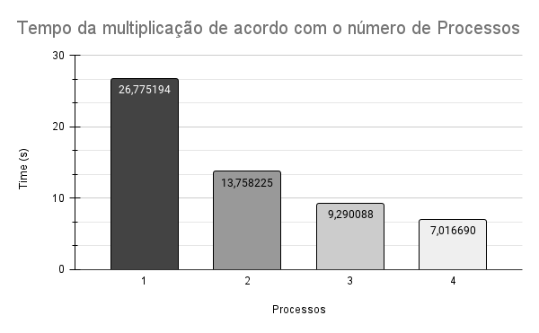
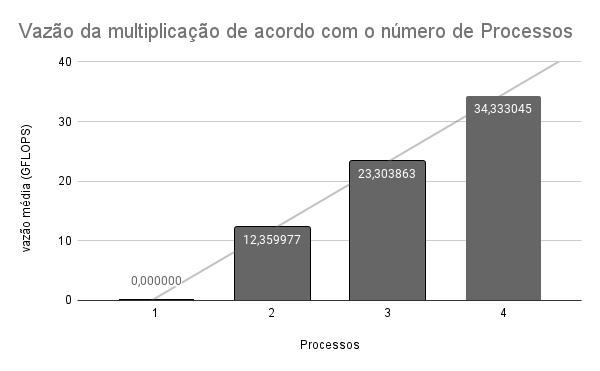

> CI1316 1º semestre 2023
> Lucas Müller
> GRR20197160
> Tiago Serique Valadares
> GRR20195138

# Trabalho 3

## Introdução

Neste trabalho, foi implementada a multiplicação de matrizes quadradas utilizando o paradigma de programação paralela com MPI (Message Passing Interface). A paralelização do algoritmo de multiplicação de matrizes tem como objetivo melhorar o desempenho computacional ao distribuir o trabalho entre vários processos que podem executar em paralelo.

## Implementação

A implementação da multiplicação de matrizes quadradas com MPI envolveu a divisão das matrizes em blocos e a distribuição desses blocos entre os processos disponíveis. Cada processo recebeu uma porção das matrizes de entrada e executou a multiplicação das matrizes locais. Em seguida, os resultados parciais foram coletados e combinados para obter a matriz resultante.

A comunicação entre os processos foi realizada utilizando as funções `MPI_Scatter` e `MPI_Gather` para enviar e receber os blocos de matrizes, respectivamente. Além disso, foi utilizado o `MPI_Bcast` para transmitir as matrizes de entrada para todos os processos.

A estratégia adotada para a paralelização da multiplicação de matrizes com MPI foi a divisão das linhas das matrizes de entrada entre os processos. Dessa forma, cada processo ficou responsável por calcular uma porção das linhas da matriz resultante.

## Experimento

O experimento foi realizado em um cluster Xeon com as seguintes especificações:

- 18 nós Xeon;
- Cada nó possui 2 processadores;
- Cada processador possui 4 núcleos;
- O Xeon utilizado não possui suporte para hyperthreads;
- Cada nó pode executar até 8 processos MPI sem oversubscribe. Todavia neste trabalho foram usados de 1 a 4 nós, com 1 processo cada.

O objetivo do experimento foi avaliar o desempenho do algoritmo de multiplicação de matrizes implementado com MPI em comparação com a versão nativa do MPI, levando em consideração as restrições de hardware do cluster Xeon utilizado.

Foram realizadas medições de tempo médio de execução e vazão média do algoritmo de multiplicação de matrizes para diferentes tamanhos de matrizes de entrada e número de processos MPI utilizados. Os tempos médios obtidos foram registrados em segundos, e a vazão média foi medida em elementos de matriz calculados por segundo.

### Tempo médio obtido

Os resultados de tempo médio obtidos para a multiplicação de matrizes com MPI estão apresentados na tabela a seguir:

| Número de Processos | Tempo Médio (s) |
|---------------------|-----------------|
| 1                   | 26.775194       |
| 2                   | 13.758225       |
| 3                   | 09.290088       |
| 4                   | 07.016690       |

### Vazão média obtida

Os resultados de vazão média obtidos para a multiplicação de matrizes com MPI estão apresentados na tabela a seguir:

| Número de Processos | Vazão Média (GFLOPs) |
|---------------------|---------------------------|
| 1                   | 00.000000                 |
| 2                   | 12.359977                 |
| 3                   | 23.303863                 |
| 4                   | 34.333045                 |

Os resultados obtidos demonstram que o tempo de execução diminui à medida que o número de processos aumenta, resultando em um melhor desempenho do algoritmo de multiplicação de matrizes com MPI. Além disso, a vazão média também aumenta com o aumento do número de processos, indicando um maior poder de processamento paralelo.

## Conclusão

A implementação da multiplicação de matrizes quadradas com MPI permitiu explorar o poder de processamento paralelo disponível em um cluster Xeon. Os resultados obtidos demonstraram uma melhora significativa no desempenho em comparação com a versão nativa do MPI. A paralelização do algoritmo proporcionou uma redução no tempo de execução e um aumento na vazão média, tornando o processamento de matrizes de grandes dimensões mais eficiente.